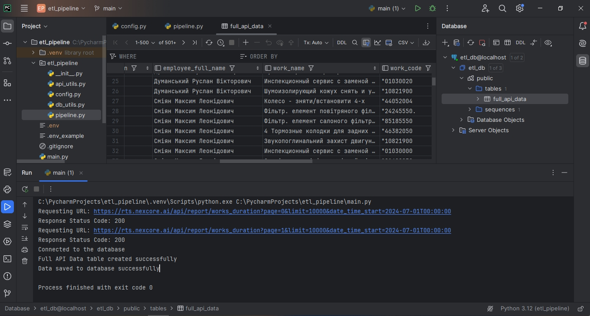
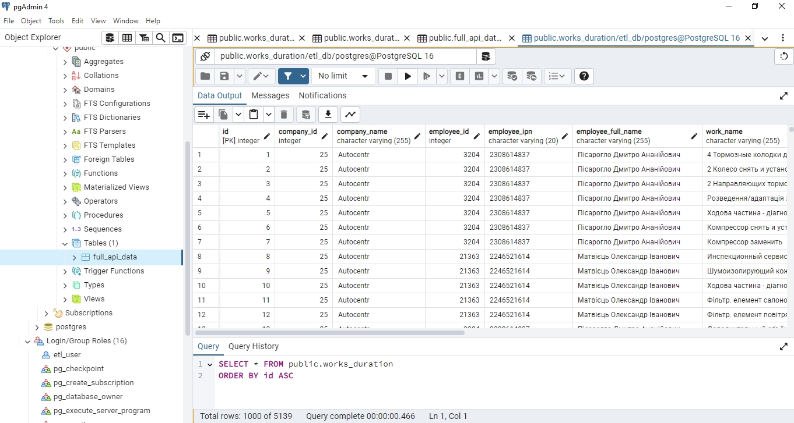
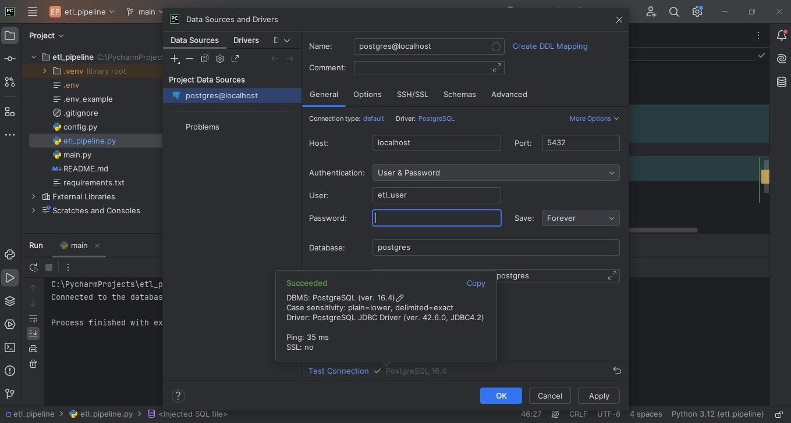

# ETL Пайплайн для API 📅📊⚙️

## Мета Завдання:
- Розробити ETL (Extract, Transform, Load) пайплайн для інтеграції з API
- Отримувати дані з API.
- Обробляти дані для збереження у базі даних.
- Зберігати оброблені дані в таблиці PostgreSQL.



## Опис Завдання:
- API, з яким потрібно працювати, надає дані у вигляді JSON. 
- Доступ до API здійснюється за допомогою токенів доступу CF-Access-Client-Id та CF-Access-Client-Secret.
- Потрібно отримати дані по кількох ендпоінтах, обробити їх і зберегти в базі даних. 
- Дані мають бути отримані у вигляді пагінованих запитів, з можливістю обробки усіх сторінок результатів.


## Реалізація:
## 1. Налаштування Конфігурацій
Створено файл config.py для зберігання конфігураційних даних:

```
import os
from dotenv import load_dotenv

# Завантаження змінних середовища з файлу .env
load_dotenv()

# API Configurations
API_BASE_URL = os.getenv("API_BASE_URL")
CLIENT_ID = os.getenv("CLIENT_ID")
CLIENT_SECRET = os.getenv("CLIENT_SECRET")

# Database Configurations
DB_NAME = os.getenv("DB_NAME")
DB_USER = os.getenv("DB_USER")
DB_PASSWORD = os.getenv("DB_PASSWORD")
DB_HOST = os.getenv("DB_HOST")
DB_PORT = os.getenv("DB_PORT")
```


## 2. Отримання Даних з API
Створено функцію get_data_from_api у файлі api_utils.py, яка здійснює запити до API

```
import requests
from etl_pipeline.config import API_BASE_URL, CLIENT_ID, CLIENT_SECRET

def get_data_from_api(endpoint, start_date, page=0, limit=10000):
    url = f"{API_BASE_URL}{endpoint}?page={page}&limit={limit}&date_time_start={start_date}"
    headers = {
        "CF-Access-Client-Id": CLIENT_ID,
        "CF-Access-Client-Secret": CLIENT_SECRET
    }
    response = requests.get(url, headers=headers)
    if response.status_code == 200:
        return response.json()
    else:
        raise Exception(f"Failed to get data: {response.status_code}, {response.text}")
```


## 3. Обробка Даних і Збереження в Базі Даних
Створено модулі для підключення до бази даних і збереження даних у файл db_utils.py

```
import psycopg2
from datetime import datetime
import pytz
from etl_pipeline.config import DB_NAME, DB_USER, DB_PASSWORD, DB_HOST, DB_PORT

def connect_to_db():
    try:
        connection = psycopg2.connect(
            dbname=DB_NAME,
            user=DB_USER,
            password=DB_PASSWORD,
            host=DB_HOST,
            port=DB_PORT
        )
        return connection
    except Exception as e:
        print(f"Failed to connect to the database: {e}")
        return None

def create_full_api_data_table(connection):
    try:
        cursor = connection.cursor()
        create_table_query = """
        CREATE TABLE IF NOT EXISTS full_api_data (
            id SERIAL PRIMARY KEY,
            company_id INTEGER,
            company_name VARCHAR(255),
            employee_id INTEGER,
            employee_ipn VARCHAR(20),
            employee_full_name VARCHAR(255),
            work_name VARCHAR(255),
            work_code VARCHAR(255),
            job_start TIMESTAMP,
            job_end TIMESTAMP,
            work_order_id INTEGER,
            work_order_number VARCHAR(255)
        );
        """
        cursor.execute(create_table_query)
        connection.commit()
        cursor.close()
    except Exception as e:
        print(f"Failed to create Full API Data table: {e}")

def save_full_api_data_to_db(connection, data):
    try:
        cursor = connection.cursor()
        insert_query = """
        INSERT INTO full_api_data (
            company_id, company_name, employee_id, employee_ipn, employee_full_name,
            work_name, work_code, job_start, job_end, work_order_id, work_order_number
        ) VALUES (%s, %s, %s, %s, %s, %s, %s, %s, %s, %s, %s)
        """
        for record in data:
            job_start = convert_utc_to_local(record.get("jobstart"))
            job_end = convert_utc_to_local(record.get("jobend"))
            cursor.execute(insert_query, (
                record.get("CompanyId"), record.get("CompanyName"), record.get("EmployeeId"), 
                record.get("EmployeeIpn"), record.get("EmployeeFullName"), record.get("workname"), 
                record.get("workcode"), job_start, job_end, record.get("workorderid"), 
                record.get("workordernumber")
            ))
        connection.commit()
        cursor.close()
    except Exception as e:
        print(f"Failed to save data to database: {e}")

def convert_utc_to_local(utc_dt_str):
    if utc_dt_str:
        try:
            utc_dt = datetime.strptime(utc_dt_str, "%Y-%m-%dT%H:%M:%S.%f")
        except ValueError:
            utc_dt = datetime.strptime(utc_dt_str, "%Y-%m-%dT%H:%M:%S")
        utc_dt = utc_dt.replace(tzinfo=pytz.utc)
        local_dt = utc_dt.astimezone(pytz.timezone("Europe/Kiev"))
        return local_dt
    return None
```

## 4. Основний Пайплайн
Створено основний скрипт pipeline.py, який об'єднує всі компоненти

```
from etl_pipeline.api_utils import get_data_from_api
from etl_pipeline.db_utils import connect_to_db, create_full_api_data_table, save_full_api_data_to_db
from etl_pipeline.config import API_BASE_URL

def get_all_data_from_api(endpoint, start_date, limit=10000):
    all_data = []
    page = 0
    while True:
        data = get_data_from_api(endpoint, start_date, page=page, limit=limit)
        if not data:
            break
        all_data.extend(data)
        page += 1
    return all_data

def main():
    start_date = "2024-07-01T00:00:00"
    endpoint = "works_duration"
    data = get_all_data_from_api(endpoint, start_date)
    if data:
        connection = connect_to_db()
        if connection:
            create_full_api_data_table(connection)
            save_full_api_data_to_db(connection, data)
            connection.close()

if __name__ == "__main__":
    main()
```

## Висновки:
- Всі дані з API отримуються через пагінацію, що забезпечує обробку великих обсягів даних без пропусків.
- Дані з API обробляються для перетворення часу з UTC в локальний час і зберігаються у таблиці бази даних.
- Дані з API зберігаються в базі даних PostgreSQL у відповідній таблиці з усіма необхідними полями.
- Код перевірено на коректність виконання ETL процесу, і він успішно зберігає дані в базу даних.